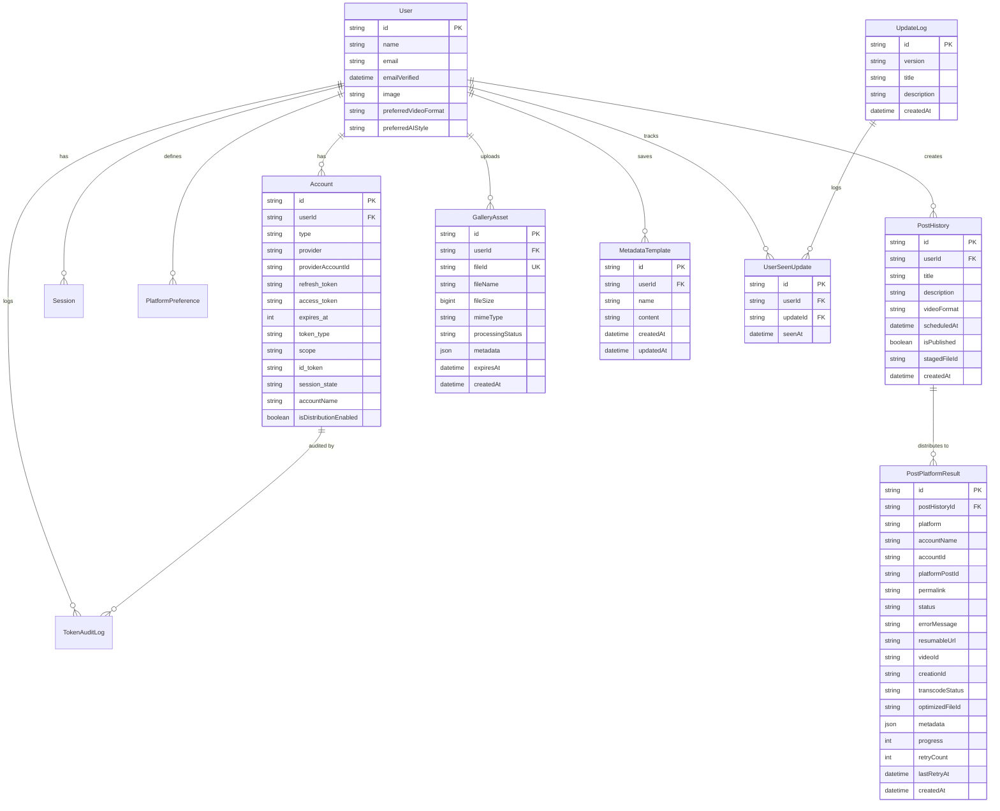
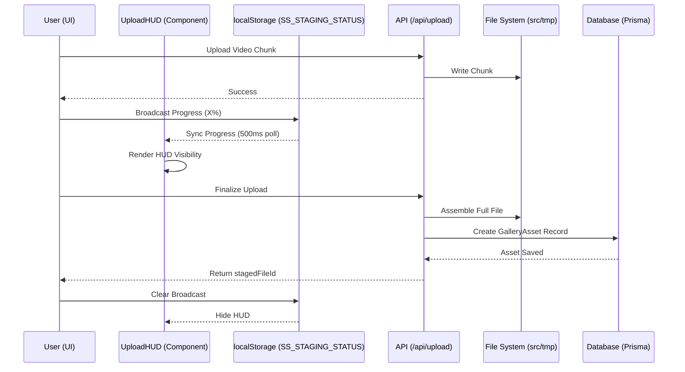
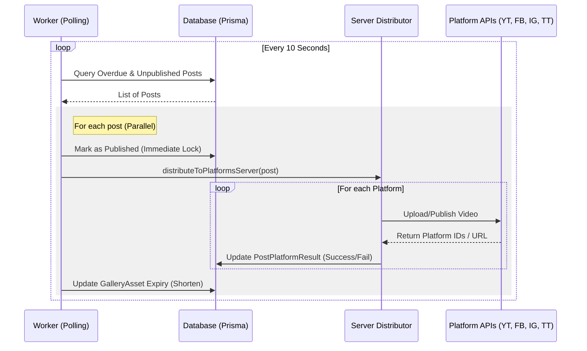
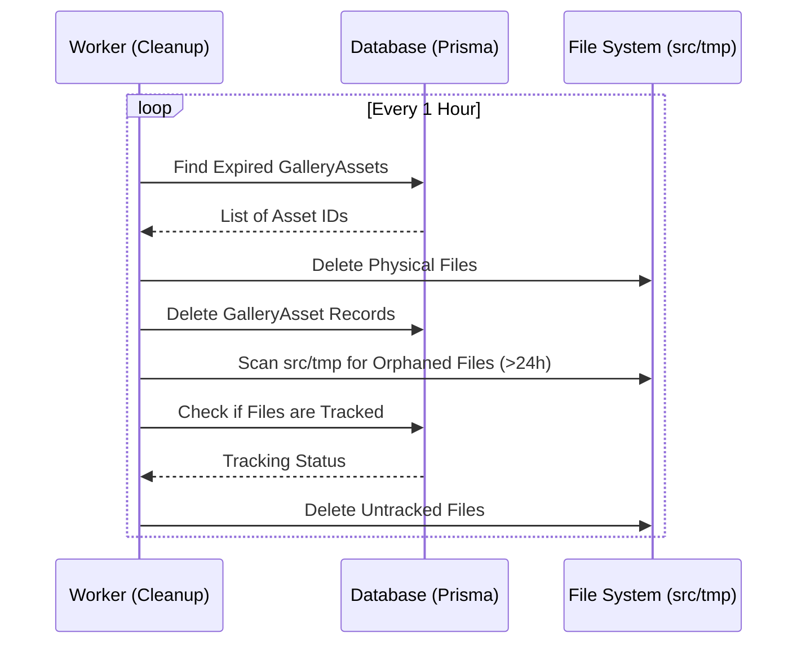
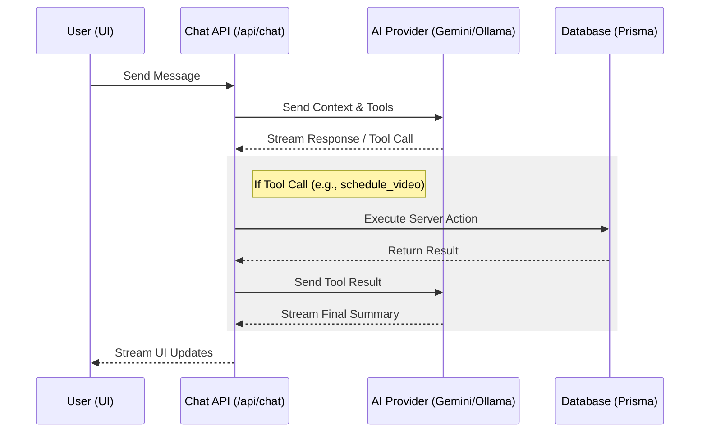
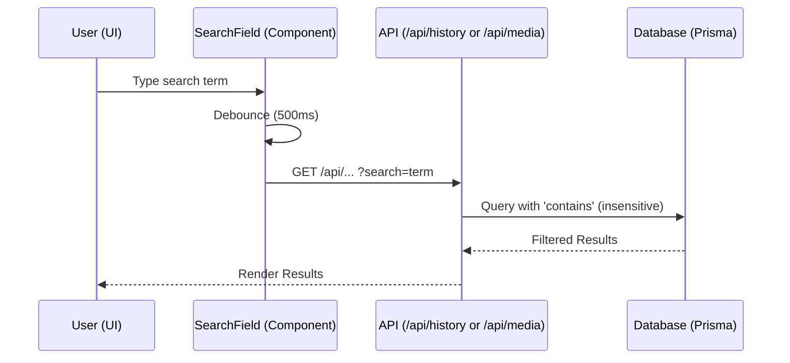
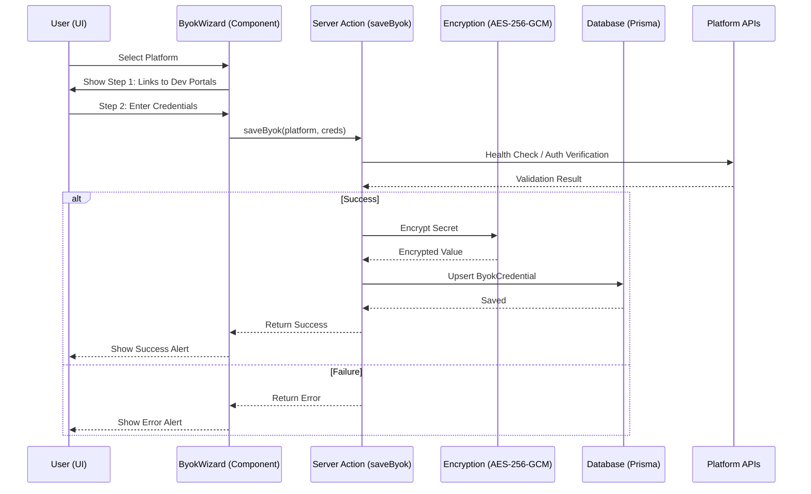
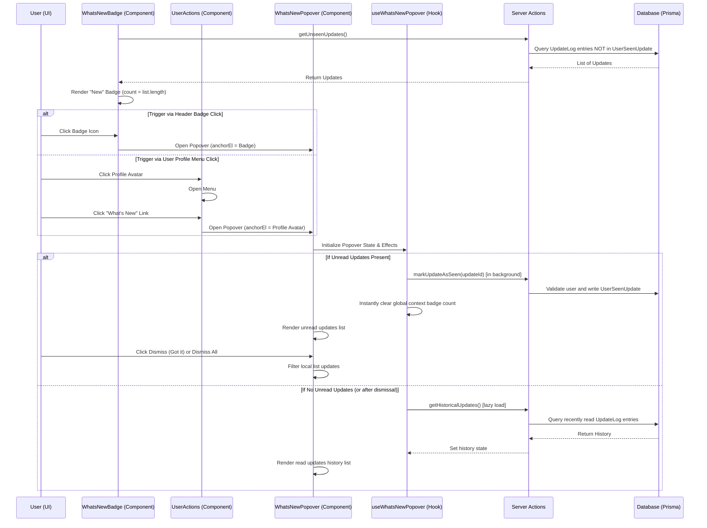
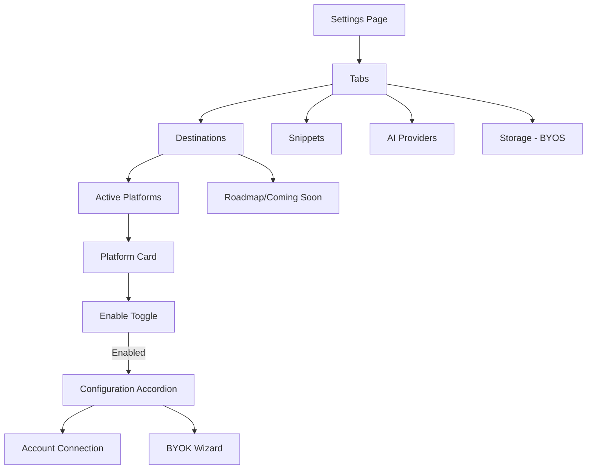

# Social Studio Architecture

This document provides a high-level overview of the Social Studio application architecture, data models, and core workflows.

## System Overview

Social Studio is a multi-platform social media management application that allows users to schedule and distribute video content (Shorts/Reels/TikToks) across various platforms simultaneously.

## Tech Stack

- **Framework:** [Next.js](https://nextjs.org/) (App Router)
- **Language:** TypeScript
- **Authentication:** [Auth.js (NextAuth)](https://authjs.dev/)
- **Database:** PostgreSQL with [Prisma ORM](https://www.prisma.io/)
- **Validation:** [Zod](https://zod.dev/) (Runtime & API validation)
- **Rate Limiting:** [Upstash Redis](https://upstash.com/)
- **Video Processing:** [FFmpeg](https://ffmpeg.org/) (via `fluent-ffmpeg`)
- **Mobile Wrapper:** [Capacitor](https://capacitorjs.com/) (iOS & Android)
- **Monitoring:** [Sentry](https://sentry.io/)
- **Styling:** Vanilla CSS, Framer Motion, Lucide React

## Data Model

The application uses a relational database schema managed by Prisma.

## Core Workflows

### 1. Media Upload & Ingestion

Users upload media which is temporarily stored on the server for processing and distribution. The system uses a **decentralized observation pattern** where upload utilities broadcast progress to `localStorage`, allowing a persistent `UploadHUD` component to provide real-time feedback across the entire application without complex prop-drilling.

### 2. Post Distribution (Publishing)

A background worker polls for scheduled posts and distributes them to selected platforms.

### 3. Asset Cleanup

To maintain storage efficiency, expired assets and orphaned files are purged regularly.

### 4. AI Chatbot Assistant

The AI Chatbot provides a conversational interface for users to manage their content, schedule posts, and view staged media. It leverages the Vercel AI SDK to stream responses and execute server-side tools.

### 5. Global Search

A unified search mechanism provides server-side filtering for history and media assets.

### 6. Platform BYOK (Bring Your Own Key)

The BYOK Integration Wizard allows power users to provide their own platform API credentials (Client ID, Secret, Redirect URI), bypassing global application-level rate limits.

- **Storage:** Credentials are persisted in the database using the `ByokCredential` model. The `clientSecret` is encrypted at rest using AES-256-GCM with a server-side `BYOK_ENCRYPTION_KEY`.
- **Credential Resolution:** A centralized `CredentialProvider` utility (`src/lib/core/credential-provider.ts`) manages the resolution of credentials, prioritizing user-provided BYOK keys and falling back to global environment variables.
- **UI Architecture:** Uses a premium **GlassCard** component with a 2-step guided flow (Get Keys -> Configure).
- **Integration:** The distribution pipeline (`src/lib/platforms/`) utilizes the `CredentialProvider` to fetch active credentials for each upload task, ensuring that power users leverage their own API quotas.

### 7. Graceful Error Handling

The application implements a hierarchical error handling strategy to ensure graceful degradation and high observability.

- **Standardized API Errors:** Server-side errors are managed using a custom `AppError` class and a centralized `handleApiError` utility. This ensures consistent error responses (message + code) and automatic Sentry reporting for unexpected failures.
- **Hierarchical Boundaries:** 
  - **Global Boundary (`global-error.tsx`):** The final safety net for root-level failures.
  - **Route Boundary (`error.tsx`):** Isolates failures to specific segments, keeping the layout interactive.
  - **Glass Aesthetic:** All error states use a shared `ErrorBoundary` component that follows the project's premium glass aesthetic, featuring blur effects and high-contrast typography.
- **Recovery:** Error boundaries provide a "Try again" mechanism that triggers a segment re-render, allowing users to recover from transient issues without a full page refresh.

### 8. What's New Notifications

Users are notified of new application updates via a badge in the header, and can also persistently access historical updates via the user profile dropdown menu.

### 9. Bring Your Own Storage (BYOS)

Users can connect their own S3/R2 storage to bypass server limits.

- **Direct Upload:** Browser uploads directly to the user's bucket using presigned URLs.
- **Service Orchestration:** Logic is modularized into dedicated services (`presign-service.ts`, `complete-service.ts`) and a specialized client (`byos-upload-client.ts`).
- **Security:** Credentials are encrypted at rest via AES-256-GCM.
- **Streaming Distribution:** Media is streamed directly from the user's bucket to platform APIs during publishing.

### 10. Unified Settings & Platform Management

The Settings page is organized into a URL-driven tabbed interface, providing a centralized hub for all configuration.

- **URL-Driven Navigation:** Tab state is persisted in the URL query string (`?tab=...`), allowing for direct linking and consistent state across refreshes.
- **Progressive Disclosure:** Platform configuration (OAuth and BYOK) is hidden behind a toggle. Once enabled, an accordion expands to reveal both basic connection management and advanced BYOK settings.
- **Platform Roadmap:** A dynamic "Coming Soon" section displays upcoming platform integrations in a grayscale, disabled state, providing transparency into the project's development roadmap.
- **Community Feedback:** A "Suggest a Platform" feature allows users to proactively request new integrations.

## Security & Role-Based Access Control (RBAC)

Social Studio implements a strict Role-Based Access Control (RBAC) system to ensure data integrity and restrict access to sensitive administrative features.

### User Roles

- **USER:** Standard role for all registered users. Allows access to core features (scheduling, media gallery, AI assistant, settings).
- **ADMIN:** Elevated role for platform administrators. Grants access to the Developer Analytics dashboard and other restricted system settings.

### Enforcement Mechanism

RBAC is enforced at multiple layers:

1.  **API Layer:** Protected API routes (e.g., `/api/admin/*`) use the `auth()` helper to verify the session and explicitly check for the `ADMIN` role. Unauthorized requests return a `401 Unauthorized` response.
2.  **UI Layer:** Administrative UI segments (like the Analytics dashboard) perform client-side role verification based on API responses and session data, rendering appropriate error states or redirects for non-admin users.
3.  **Navigation:** The application sidebar dynamically filters links based on the user's role, hiding administrative entry points from standard users.

### Testing Identity

For automated and manual verification, dedicated identities are used:
- **Tester (`tester@socialstudio.ai`):** A standard `USER` account used for E2E testing of common user flows.
- **Admin (`admin@socialstudio.ai`):** A dedicated `ADMIN` account used for verifying administrative access and system health monitoring.

## Platform Integrations

Platform-specific logic is encapsulated in `src/lib/platforms/`.

- **YouTube:** Uses Google APIs Node.js client with resumable upload support.
- **Facebook/Instagram:** Uses Meta Graph API (Video/Reels endpoints).
- **TikTok:** Uses TikTok Content Posting API.
- **Local:** Simulates distribution for testing purposes.

## Mobile Architecture

The app is wrapped using **Capacitor**, allowing it to run as a native app on iOS and Android while sharing the same web codebase. Native features (camera, gallery, auth) are accessed via Capacitor plugins.

## Testing & Quality Assurance

The application maintains a high standard of quality through automated testing and strict TypeScript enforcement.

### 1. E2E Testing (Playwright)

End-to-End tests are located in `src/__tests__/e2e/` and cover critical user journeys such as authentication, metadata management, and post scheduling.

- **Automated Authentication:** The test suite uses a dedicated E2E user (`tester@socialstudio.ai`). A setup project (`auth.setup.ts`) performs a real login via the Credentials provider and saves the session state to `.auth/user.json`, allowing subsequent tests to skip the login step.
- **Environment Requirements:** E2E tests require `NEXT_PUBLIC_E2E=true` and `NODE_ENV=development` to enable the Credentials provider on the server.
- **Port Standardization:** E2E tests are configured to run Next.js on port `3005` (via `playwright.config.ts` using the TCP port wait method) to prevent collisions with the default development server on port 3000.
- **Locators:** Tests prioritize accessible roles (`getByRole`) and `data-testid` attributes for robustness.

### 2. Unit & Integration Testing (Vitest)

Unit tests for utility functions and integration tests for server actions are located in `src/__tests__/unit/` and `src/__tests__/integration/`.

- **Test Environment:** The testing environment is configured via `vitest.config.ts` and `src/__tests__/setup.ts`. For components or utilities interacting with credentials (e.g., BYOS/BYOK), a mock `ENCRYPTION_KEY` is injected globally.
- **Mocking Strategy:** External APIs (like OpenAI for chat) and platform dependencies are heavily mocked to prevent timeouts and external network dependencies.
- **Execution:** Certain integration or E2E tests interacting heavily with the database (like schedule navigation or parallel uploads) are configured to run serially to avoid race conditions.

### 3. Agent Orchestration

The project uses specialized AI agents (Discovery, Dev, Review, QA) to manage the development lifecycle, ensuring that every change is planned, implemented, audited, and verified before merging.

## Production Readiness

To ensure stability, security, and traceability in a production environment, Social Studio implements:

- **Observability:** Sentry is integrated on both the client (`sentry.edge.config.ts`, `sentry.server.config.ts`) and server, capturing unhandled exceptions and performance metrics. Sentry error reporting is used across server actions and API routes.
- **Rate Limiting:** Upstash Redis is used for distributed rate limiting. Critical endpoints (like upload API routes and AI actions) are protected to prevent abuse and manage API costs.
- **Runtime Validation:** Zod schemas enforce strict validation of request payloads and function arguments across server actions (`action-utils.ts`) and API routes, acting as a guard against malformed data and ensuring type safety at the boundary layer.

## Deployment & Infrastructure

- **Vercel:** Hosts the Next.js application and API routes.
- **PostgreSQL:** Primary data store (likely Vercel Postgres or Supabase).
- **Cloudflared:** Used for local development tunneling to test webhooks and platform callbacks.
- **Worker Process:** A separate `tsx` process (`scripts/worker.ts`) runs the background polling and cleanup logic.
