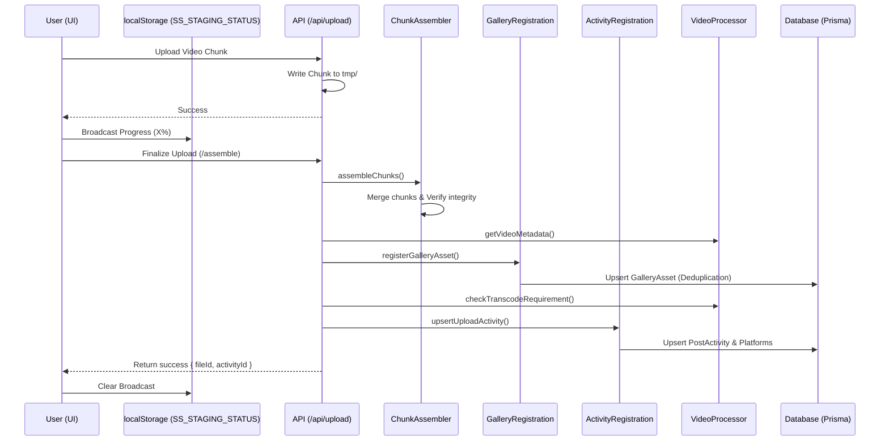
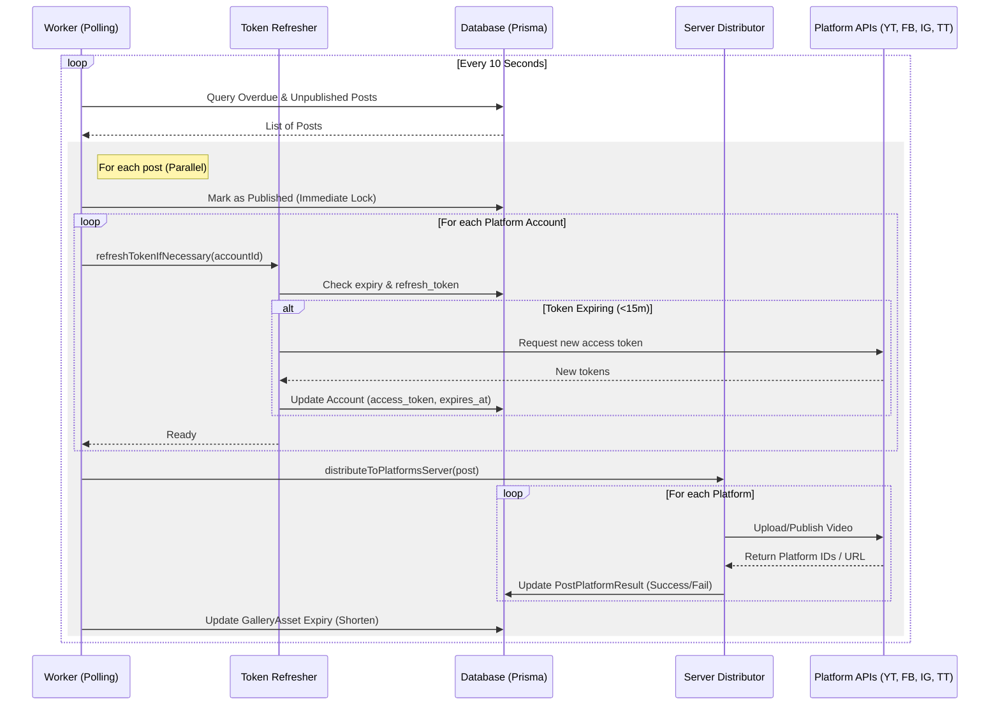
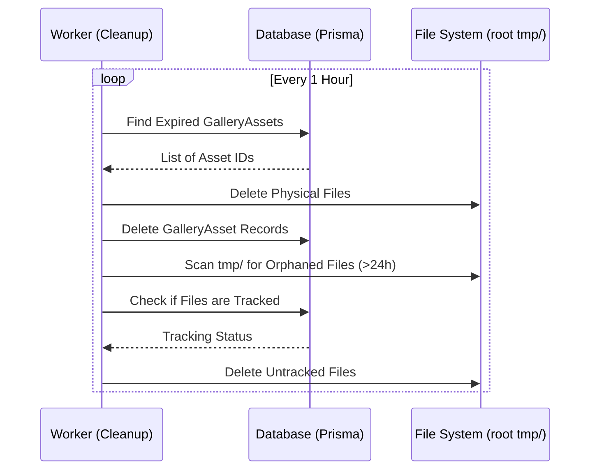
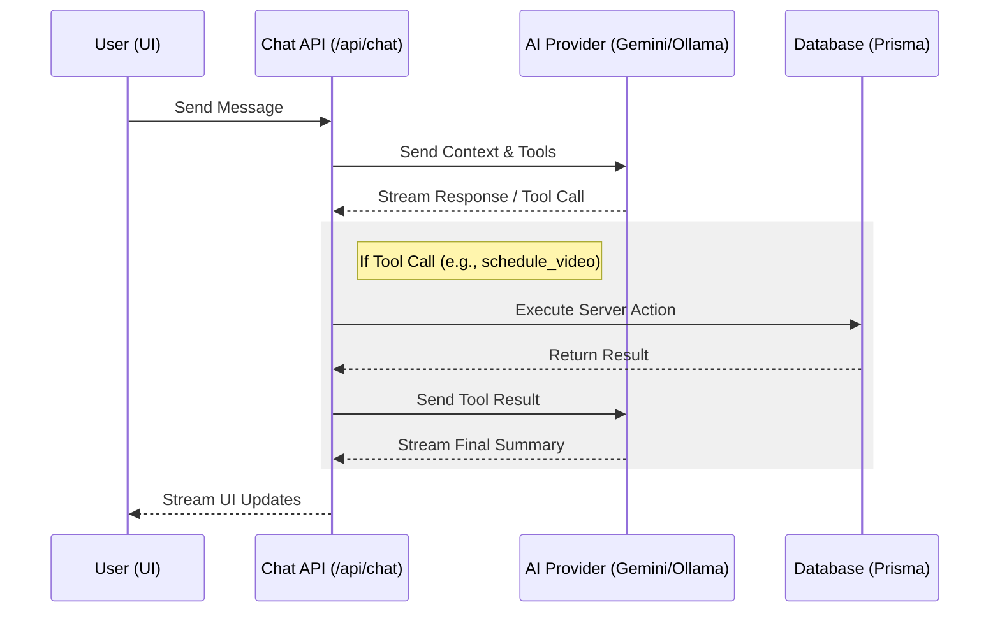
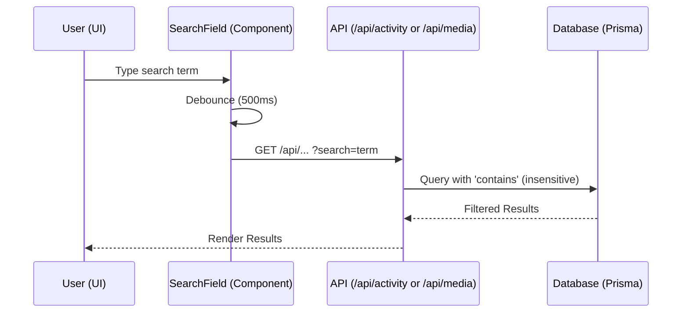
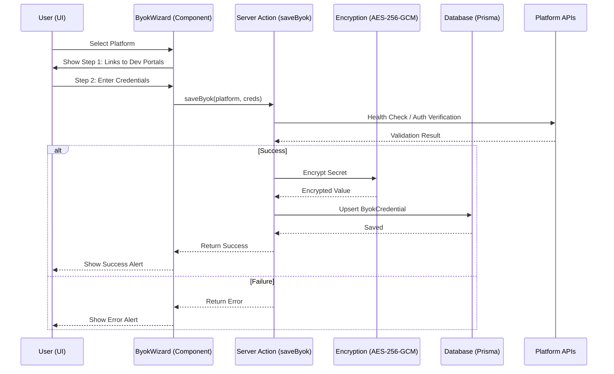
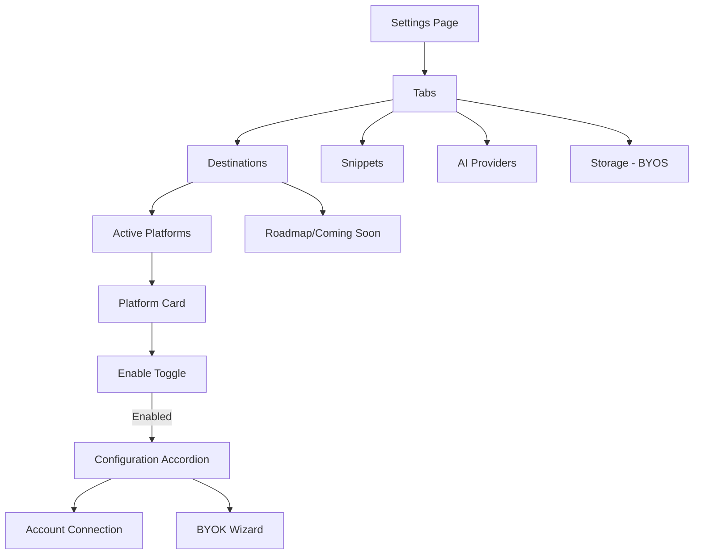

# Social Studio Architecture

This document provides a high-level overview of the Social Studio application architecture, data models, and core workflows.

## System Overview

Social Studio is a multi-platform social media management application that allows users to schedule and distribute video content (Shorts/Reels/TikToks) across various platforms simultaneously.

## Tech Stack

- **Framework:** [Next.js](https://nextjs.org/) (App Router)
- **Language:** TypeScript
- **Authentication:** [Auth.js (NextAuth)](https://authjs.dev/)
- **Database:** PostgreSQL with [Prisma ORM](https://www.prisma.io/)
- **Validation:** [Zod](https://zod.dev/) (Runtime & API validation)
- **Rate Limiting:** [Upstash Redis](https://upstash.com/)
- **Video Processing:** [FFmpeg](https://ffmpeg.org/) (via `fluent-ffmpeg`)
- **Mobile Wrapper:** [Capacitor](https://capacitorjs.com/) (iOS & Android)
- **Monitoring:** [Sentry](https://sentry.io/)
- **Styling:** Vanilla CSS, Framer Motion, Lucide React

## Data Model

The application uses a relational database schema managed by Prisma.

## Core Workflows

### 1. Media Upload & Ingestion

Users upload media which is temporarily stored on the server for processing and distribution. The system uses a **decentralized observation pattern** where upload utilities broadcast progress to `localStorage`, allowing a persistent `UploadHUD` component to provide real-time feedback across the entire application without complex prop-drilling.

The finalization process is orchestrated by specialized modular services to ensure data integrity, gallery consistency, and publishing readiness.

### 2. Post Distribution (Publishing)

A background worker polls for scheduled posts and distributes them to selected platforms. It automatically refreshes OAuth tokens if they are nearing expiration (within 15 minutes) to ensure uninterrupted publishing.

### 3. Modular Distribution Layer

The platform distribution logic is organized into a modular architecture that separates shared infrastructure from platform-specific implementation details. This ensures maintainability and simplifies the addition of new platforms.

#### Core Infrastructure (`src/lib/core/platforms/`)

Contains shared utilities and types used across multiple platforms:
- **`account-utils.ts`**: Centralized logic for retrieving platform accounts and logging token usage audits.
- **`meta-uploader.ts`**: Shared binary upload logic for Meta-based platforms (Facebook, Instagram).
- **`meta-utils.ts`**: Common Meta Graph API helpers (polling status, fetching pages).
- **`types.ts`**: Unified interfaces for publishing parameters and results.

#### Platform Modules (`src/lib/platforms/`)

Each platform follows a modular subdirectory pattern (e.g., `src/lib/platforms/instagram/`):
- **`account.ts`**: Platform-specific account resolution and permission validation.
- **`container.ts` / `reel.ts`**: Logic for initializing upload sessions or containers.
- **`finalize.ts`**: Steps required to complete a publication (e.g., publishing a container, fetching permalinks).
- **`stats.ts`**: Logic for fetching platform-specific engagement metrics.
- **`[platform].ts`**: The main orchestrator file (e.g., `instagram.ts`) that exports the public API by composing the modular sub-units.

#### Server Orchestration

The `distributor-server.ts` acts as the high-level router, using dynamic imports to load platform orchestrators only when needed. This keeps the worker process lightweight and isolates platform-specific dependencies.

### 4. Asset Cleanup

To maintain storage efficiency, expired assets and orphaned files are purged regularly.

### 5. AI Chatbot Assistant

The AI Chatbot provides a conversational interface for users to manage their content, schedule posts, and view staged media. It leverages the Vercel AI SDK to stream responses and execute server-side tools.

### 6. Global Search

A unified search mechanism provides server-side filtering for activity and media assets.

### 7. Platform BYOK (Bring Your Own Key)

The BYOK Integration Wizard allows power users to provide their own platform API credentials (Client ID, Secret, Redirect URI), bypassing global application-level rate limits.

- **Storage:** Credentials are persisted in the database using the `ByokCredential` model. The `clientSecret` is encrypted at rest using AES-256-GCM with a server-side `BYOK_ENCRYPTION_KEY`.
- **Credential Resolution:** A centralized `CredentialProvider` utility (`src/lib/core/credential-provider.ts`) manages the resolution of credentials, prioritizing user-provided BYOK keys and falling back to global environment variables.
- **UI Architecture:** Uses a premium **GlassCard** component with a 2-step guided flow (Get Keys -> Configure).
- **Integration:** The distribution pipeline (`src/lib/platforms/`) utilizes the `CredentialProvider` to fetch active credentials for each upload task, ensuring that power users leverage their own API quotas.

### 8. Graceful Error Handling

The application implements a hierarchical error handling strategy to ensure graceful degradation and high observability.

- **Standardized API Errors:** Server-side errors are managed using a custom `AppError` class and a centralized `handleApiError` utility. This ensures consistent error responses (message + code) and automatic Sentry reporting for unexpected failures.
- **Hierarchical Boundaries:** 
  - **Global Boundary (`global-error.tsx`):** The final safety net for root-level failures.
  - **Route Boundary (`error.tsx`):** Isolates failures to specific segments, keeping the layout interactive.
  - **Glass Aesthetic:** All error states use a shared `ErrorBoundary` component that follows the project's premium glass aesthetic, featuring blur effects and high-contrast typography.
- **Recovery:** Error boundaries provide a "Try again" mechanism that triggers a segment re-render, allowing users to recover from transient issues without a full page refresh.

### 9. What's New Notifications

Users are notified of new application updates via a badge in the header, and can also persistently access historical updates via the user profile dropdown menu.

### 10. Bring Your Own Storage (BYOS)

Users can connect their own S3/R2 storage to bypass server limits.

- **Direct Upload:** Browser uploads directly to the user's bucket using presigned URLs.
- **Service Orchestration:** Logic is modularized into dedicated services (`presign-service.ts`, `complete-service.ts`) and a specialized client (`byos-upload-client.ts`).
- **Security:** Credentials are encrypted at rest via AES-256-GCM.
- **Streaming Distribution:** Media is streamed directly from the user's bucket to platform APIs during publishing.

### 11. Unified Settings & Platform Management

The Settings page is organized into a URL-driven tabbed interface, providing a centralized hub for all configuration.

- **URL-Driven Navigation:** Tab state is persisted in the URL query string (`?tab=...`), allowing for direct linking and consistent state across refreshes.
- **Modular Architecture:** The settings page follows a strict modular design to maintain readability and comply with the project's 50-line rule (automated via ESLint). The main `SettingsContent` component acts as a router, delegating tab rendering to specialized components:
  - `SettingsTabs`: Manages the tab navigation and URL state synchronization.
  - `DestinationsTab`: Encapsulates platform connection logic, account management, and API fetching.
  - `RoadmapPlatforms`: Renders the upcoming platform integrations and "Coming Soon" section.
- **Progressive Disclosure:** Platform configuration (OAuth and BYOK) is hidden behind a toggle. Once enabled, an accordion expands to reveal both basic connection management and advanced BYOK settings.
- **Platform Roadmap:** A dynamic "Coming Soon" section displays upcoming platform integrations in a grayscale, disabled state, providing transparency into the project's development roadmap.
- **Community Feedback:** A "Suggest a Platform" feature allows users to proactively request new integrations.

### 12. Global Refresh Mechanism

Social Studio implements a unified refresh system to ensure data consistency between server-side state and client-side components.

- **Centralized Logic:** The `useAppRefresh` hook handles the orchestration of `router.refresh()` (for server components) and the dispatching of custom events (for client components).
- **Event Synchronization:** Components can synchronize their state by listening to the `app:refresh` event on `globalThis`. This pattern allows decoupled components to respond to user-initiated refreshes without complex state management.
- **Mobile Gestures:** The system is integrated with a "Pull-to-Refresh" mechanism in the `LayoutWrapper`, providing a native-like experience for mobile users.
- **UX & Feedback:** A minimum delay is enforced to provide satisfying visual feedback, ensuring the user perceives the refresh action regardless of network speed.

For more details, see the [Global Refresh Feature Documentation](features/GLOBAL_REFRESH.md).

### 13. Activity Domain Architecture

The Activity domain manages the record of all past and upcoming posts. To maintain scalability and performance, the domain follows a highly modular architecture that adheres to the project's strict 50-line rule (automated via ESLint).

- **Decomposed Server Actions:** Logic for fetching, retrying, and canceling activity items is split into specialized modules within `src/app/actions/activity/`.
    - **`core.ts` / `cancel.ts` / `retry.ts`**: High-level action entry points.
    - **`prisma-helpers.ts` / `activity-helpers.ts` / `retry-helpers.ts`**: Shared database lookups, title generation, and status mapping logic.
    - **`retry-executor.ts`**: Isolated distribution orchestration for retry attempts.
- **Specialized Hooks:** A composite `useActivity` hook orchestrates multiple sub-hooks to manage complex state and logic:
    - `useActivityState`: Manages local state for filters, pagination, and data storage.
    - `useActivityData` / `useActivityFetcher` / `useActivityPolling`: Handles data fetching, adaptive polling (5s active / 15s idle), and pagination lifecycle.
    - `useActivityActions` / `useRetryHandler` / `useCancelHandlers`: Provides modularized handlers for user interactions.
    - `useActivityCockpit`: Manages "Cockpit" mode for real-time distribution monitoring.
- **Optimistic UI & Reconciliation**: The `useActivity` hook centralizes the logic for merging active "pending" posts with historical data, ensuring a seamless optimistic experience without bloated UI components.
- **Component Decomposition:** The Activity page is split into a server-side shell (`page.tsx`) and a focused client-side renderer (`ActivityContent.tsx`), which delegates to small MUI components (`ActivityHeader`, `ActivityList`, etc.).

### 14. Complex UI Form Architecture (Modular Engine)

Complex forms (like the Upload Form) follow a "Modular Engine" pattern to manage deep state and UI complexity while adhering to the 50-line rule (automated via ESLint).

- **Provider-Consumer Pattern:** The form is wrapped in a dedicated `UploadFormProvider` (Context) that consolidates state from props, custom hooks, and local signals. This eliminates prop-drilling across deep component trees.
- **Atomic Decomposition:** Large forms are broken down into a hierarchy of atomic, single-responsibility components:
    - `index.tsx`: Pure entry point that initializes the Provider.
    - `UploadFormInner.tsx`: Orchestrates the high-level layout.
    - `StandardMetadataFields`, `PlatformMetadataFields`, `VideoSelection`: Focused sub-components that consume the context.
- **Hook-Driven Logic:** Business logic (media parsing, template management) is extracted into specialized hooks (e.g., `useUploadForm`, `useMediaLibrary`) which are then integrated into the Context.
- **Visual Feedback:** All atomic units maintain visual consistency using MUI components and shared style modules, ensuring a unified "glass" aesthetic across all form states.

### 15. API Architecture & Documentation

Social Studio utilizes a hybrid API architecture consisting of Next.js Route Handlers and Server Actions, with a strong emphasis on standardization and documentation.

#### Documentation (Swagger/OpenAPI)

The application maintains a "Living Source of Truth" for its API surface using Swagger/OpenAPI.
- **Access:** Interactive documentation is available at `/api/docs`.
- **Implementation:** Routes are registered in the OpenAPI specification, enabling automated client generation and consistent error responses.
- **Requirement:** Every new Route Handler must be accompanied by an OpenAPI registration entry.

#### Centralized Schemas

All data validation and type inference are managed through centralized Zod schemas located in `src/lib/schemas/`. This ensures:
- **Consistency:** The same validation logic is applied to API routes, Server Actions, and UI forms.
- **Maintainability:** Changes to data structures only need to be updated in one location.
- **Type Safety:** TypeScript types are inferred directly from these schemas.

### 16. Route Handlers vs. Server Actions

The project follows a specific strategy for choosing between Route Handlers and Server Actions:

- **Route Handlers:** Reserved for binary data/streaming (uploads, media streaming), external webhooks (TikTok proxy), third-party tool access, and long-running tasks requiring custom duration settings.
- **Server Actions:** Preferred for UI-triggered mutations, simple database updates, and lightweight queries. They provide tighter TypeScript integration and reduce public API surface.

For a detailed analysis, refer to [API_ARCHITECTURE_REPORT.md](API_ARCHITECTURE_REPORT.md).

### 17. Automated Token Refresh

To maintain long-term connectivity without requiring frequent user re-authentication, the system implements an automated token refresh mechanism.

- **Trigger:** The background publishing worker checks the expiration status of OAuth tokens for all accounts involved in a scheduled post.
- **Buffer:** Tokens are refreshed if they are set to expire within **15 minutes**.
- **Provider Logic:** 
    - **Google/YouTube:** Uses the `refresh_token` to obtain a new `access_token` via the Google OAuth2 client.
    - **TikTok:** Uses the `refresh_token` to obtain new tokens via the TikTok Content Posting API.
    - **Facebook/Instagram:** Currently relies on long-lived tokens (typically 60 days) and manual re-auth, as Meta handles refresh differently.
- **Persistence:** New tokens and updated expiration timestamps are persisted to the `Account` table immediately after a successful refresh.
- **Audit:** Token refresh events are logged to the system logger for traceability.

### 18. Modular Upload Infrastructure

The upload pipeline utilizes a suite of specialized services to manage the complex transition from raw binary data to a scheduled post activity.

#### Core Services (`src/lib/upload/`)

- **`ChunkAssembler` (`chunk-assembler.ts`)**: Handles the physical concatenation of multi-part uploads. It ensures file integrity via size verification and manages the cleanup of temporary chunk directories.
- **`GalleryRegistration` (`gallery-registration.ts`)**: Manages the persistence of assembled files into the `GalleryAsset` table. It implements deduplication logic to prevent redundant storage of identical assets from the same user.
- **`ActivityRegistration` (`activity-registration.ts`)**: Orchestrates the initialization or update of `PostActivity` records. It handles platform-specific metadata pre-flighting and links the uploaded media to its target distribution channels.
- **`VideoProcessor` (`src/lib/video/processor.ts`)**: Provides metadata extraction (duration, resolution) and determines if the media requires transcoding for specific platform requirements (e.g., aspect ratio checks).

#### Integration Logic

These services are composed within the `/api/upload/assemble` route handler, which acts as a transactional orchestrator. This modularity ensures that the upload logic is decoupled from the HTTP transport layer and can be reused in other contexts, such as background processing or administrative tools.

## Security & Role-Based Access Control (RBAC)

Social Studio implements a strict Role-Based Access Control (RBAC) system to ensure data integrity and restrict access to sensitive administrative features.

### User Roles

- **USER:** Standard role for all registered users. Allows access to core features (scheduling, media gallery, AI assistant, settings).
- **ADMIN:** Elevated role for platform administrators. Grants access to the Developer Analytics dashboard and other restricted system settings.

### Enforcement Mechanism

RBAC is enforced at multiple layers:

1.  **API Layer:** Protected API routes (e.g., `/api/admin/*`) use the `auth()` helper to verify the session and explicitly check for the `ADMIN` role. Unauthorized requests return a `401 Unauthorized` response.
2.  **UI Layer:** Administrative UI segments (like the Analytics dashboard) perform client-side role verification based on API responses and session data, rendering appropriate error states or redirects for non-admin users.
3.  **Navigation:** The application sidebar dynamically filters links based on the user's role, hiding administrative entry points from standard users.

### File System Security

To prevent unauthorized file access and data leakage, the application implements several file system security measures:

- **Path Traversal Protection:** All file-related API routes (e.g., `/api/media/[fileId]`, `/api/upload`) perform strict validation of input paths. File identifiers are sanitized and checked against expected patterns to ensure they cannot be used to access files outside the designated `tmp/` or storage directories.
- **Ownership Verification:** File access is tied to the `userId` of the uploader. Every request to retrieve or modify a media asset involves a database check to ensure the requesting user owns the asset.
- **Atomic Cleanup:** The background worker ensures that temporary files and chunk directories are cleaned up even if processes are interrupted, preventing the accumulation of sensitive orphaned data.

### Testing Identity

For automated and manual verification, dedicated identities are used:
- **Tester (`tester@socialstudio.ai`):** A standard `USER` account used for E2E testing of common user flows.
- **Admin (`admin@socialstudio.ai`):** A dedicated `ADMIN` account used for verifying administrative access and system health monitoring.

## Platform Integrations

Platform-specific logic is encapsulated in `src/lib/platforms/`.

- **YouTube:** Uses Google APIs Node.js client with resumable upload support.
- **Facebook/Instagram:** Uses Meta Graph API (Video/Reels endpoints).
- **TikTok:** Uses TikTok Content Posting API.
- **Local:** Simulates distribution for testing purposes.

## Mobile Architecture

The app is wrapped using **Capacitor**, allowing it to run as a native app on iOS and Android while sharing the same web codebase. Native features (camera, gallery, auth) are accessed via Capacitor plugins.

## Testing & Quality Assurance

The application maintains a high standard of quality through automated testing and strict TypeScript enforcement.

### 1. E2E Testing (Playwright)

End-to-End tests are located in `src/__tests__/e2e/` and cover critical user journeys such as authentication, metadata management, and post scheduling.

- **Automated Authentication:** The test suite uses a dedicated E2E user (`tester@socialstudio.ai`). A setup project (`auth.setup.ts`) performs a real login via the Credentials provider and saves the session state to `.auth/user.json`, allowing subsequent tests to skip the login step.
- **Helper Scripts:** Complex setup tasks (seeding users, scheduling posts, granting admin rights) are managed via specialized scripts in `src/__tests__/scripts/`.
- **Environment Requirements:** E2E tests require `NEXT_PUBLIC_E2E=true` and `NODE_ENV=development` to enable the Credentials provider on the server.
- **Port Standardization:** E2E tests are configured to run Next.js on port `3005` (via `playwright.config.ts` using the TCP port wait method) to prevent collisions with the default development server on port 3000.
- **Locators:** Tests prioritize accessible roles (`getByRole`) and `data-testid` attributes for robustness.

### 2. Unit & Integration Testing (Vitest)

Unit tests for utility functions and integration tests for server actions are located in `src/__tests__/unit/` and `src/__tests__/integration/`.

- **Test Environment:** The testing environment is configured via `vitest.config.ts` and `src/__tests__/setup.ts`. For components or utilities interacting with credentials (e.g., BYOS/BYOK), a mock `ENCRYPTION_KEY` is injected globally.
- **Mocking Strategy:** External APIs (like OpenAI for chat) and platform dependencies are heavily mocked to prevent timeouts and external network dependencies.
- **Execution:** Certain integration or E2E tests interacting heavily with the database (like schedule navigation or parallel uploads) are configured to run serially to avoid race conditions.

### 3. Agent Orchestration

The project uses specialized AI agents (Discovery, Dev, Review, QA) to manage the development lifecycle, ensuring that every change is planned, implemented, audited, and verified before merging.

#### Modular Orchestration Rules (GEMINI.md)

To maintain context efficiency and prevent "rule bloat", the project's core orchestration rules (originally in `GEMINI.md`) are modularized into domain-specific files under `.gemini/base/`:

- **CORE.md:** Technical standards, TypeScript strictness, and Next.js 15/React 19 conventions.
- **UI_UX.md:** Aesthetic standards, Material UI conventions, and accessibility mandates.
- **PRODUCTION.md:** Reliability, performance, security, and observability standards.
- **ORCHESTRATION.md:** Agent roles, handoff protocols, state management (pruning), and Discovery DoR.

Agents are required to read these modular files based on their current task domain.

### 4. Modularity Enforcement (The 50-Line Rule)

The project enforces a strict 50-line limit for all source files to ensure high maintainability and prevent monolithic modules.
- **Automation:** This rule is automatically enforced via ESLint's `max-lines` rule. Violations will trigger an error and block the CI pipeline.
- **Exceptions:** Test files (`src/__tests__/**`) are exempt from this rule to allow for comprehensive test suites.
- **Legacy Support:** Existing files that exceed the limit are "grandfathered" using `/* eslint-disable max-lines */`. Developers are required to extract logic into compliant modules whenever touching these legacy files.

### 5. Modern Web Standards

The project integrates the `@GoogleChrome/modern-web-guidance` Gemini CLI extension to ensure adherence to modern web performance and quality standards.
- **Workflow Integration:** Performance audits and best-practice checks are a mandatory part of the Review and QA phases, as defined in `.gemini/base/ORCHESTRATION.md`.
- **Optimization Focus:** Continuous monitoring of Core Web Vitals (LCP, INP, CLS) and idiomatic React 19 / Next.js 16 patterns (e.g., proper RSC boundaries, using `proxy.ts` convention).

### 6. Production Readiness

To ensure stability, security, and traceability in a production environment, Social Studio implements:

- **Observability:** Sentry is integrated on both the client (`sentry.edge.config.ts`, `sentry.server.config.ts`) and server, capturing unhandled exceptions and performance metrics. Sentry error reporting is used across server actions and API routes.
- **Rate Limiting:** Upstash Redis is used for distributed rate limiting. Critical endpoints (like upload API routes and AI actions) are protected to prevent abuse and manage API costs.
- **Runtime Validation:** Zod schemas enforce strict validation of request payloads and function arguments across server actions (`action-utils.ts`) and API routes, acting as a guard against malformed data and ensuring type safety at the boundary layer.
- **Infrastructure Safety:** Production deployments utilize strict directory isolation and automated cleanup tasks to maintain server health.

## Deployment & Infrastructure

- **Vercel:** Hosts the Next.js application and API routes.
- **PostgreSQL:** Primary data store (likely Vercel Postgres or Supabase).
- **Cloudflared:** Used for local development tunneling to test webhooks and platform callbacks.
- **Worker Process:** A separate `tsx` process (`scripts/worker.ts`) runs the background polling and cleanup logic.
- **Atomic Symlink Deploys:** The production deployment on Oracle VPS utilizes an atomic symlink strategy. A `current` symlink points to a version-controlled release directory, enabling zero-downtime updates and near-instant rollbacks by swapping the symlink target.
