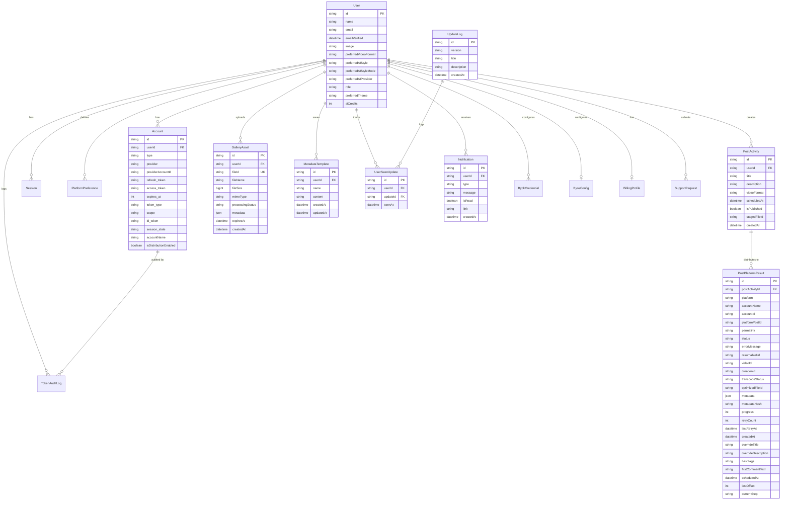

# Data Model

The application uses a relational database schema managed by Prisma.

## Additional Models

- **ByokCredential:** Stores Bring-Your-Own-Key API credentials for users (e.g., OpenAI, Anthropic keys).
- **ByosConfig:** Stores Bring-Your-Own-Storage configurations for users (e.g., custom S3 or R2 buckets).
- **BillingProfile:** Tracks the user's subscription tier and billing status (e.g., via Stripe).
- **SupportRequest:** User-submitted support tickets and messages.
- **SystemBilling:** Tracks global system spending and thresholds for API providers.
- **SystemMetric:** Logs system-wide performance and usage metrics.
