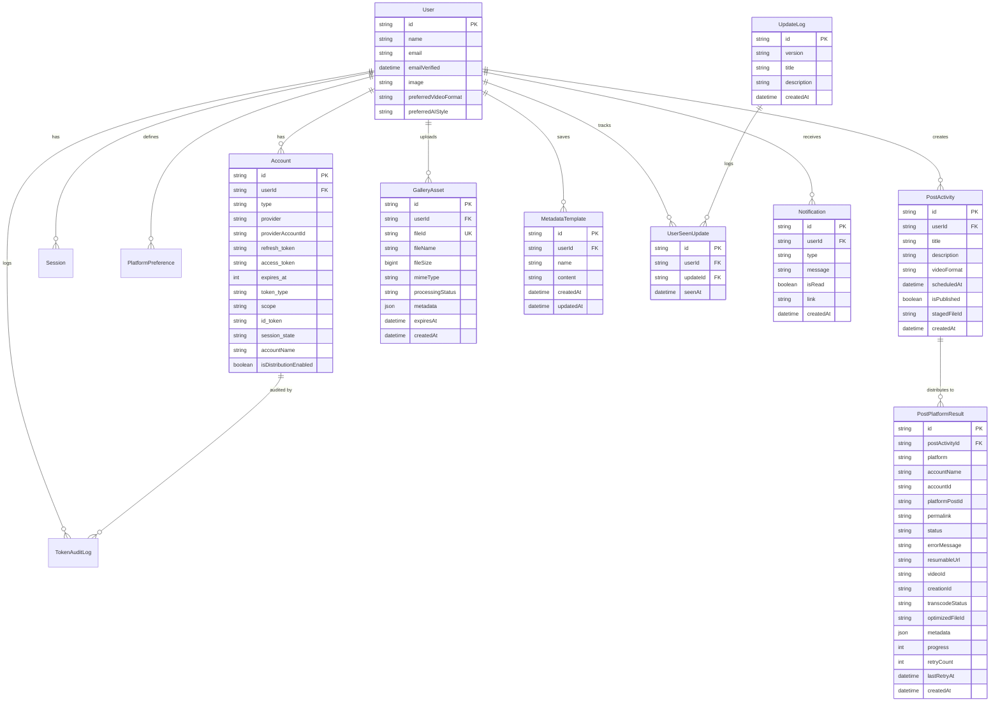

# Data Model

The application uses a relational database schema managed by Prisma.

```mermaid
erDiagram
    User ||--o{ Account : "has"
    User ||--o{ Session : "has"
    User ||--o{ PlatformPreference : "defines"
    User ||--o{ PostActivity : "creates"
    User ||--o{ GalleryAsset : "uploads"
    User ||--o{ TokenAuditLog : "logs"
    User ||--o{ MetadataTemplate : "saves"
    User ||--o{ UserSeenUpdate : "tracks"
    User ||--o{ Notification : "receives"
    UpdateLog ||--o{ UserSeenUpdate : "logs"

    Account ||--o{ TokenAuditLog : "audited by"

    PostActivity ||--o{ PostPlatformResult : "distributes to"

    User {
        string id PK
        string name
        string email
        datetime emailVerified
        string image
        string preferredVideoFormat
        string preferredAIStyle
    }

    MetadataTemplate {
        string id PK
        string userId FK
        string name
        string content
        datetime createdAt
        datetime updatedAt
    }

    Account {
        string id PK
        string userId FK
        string type
        string provider
        string providerAccountId
        string refresh_token
        string access_token
        int expires_at
        string token_type
        string scope
        string id_token
        string session_state
        string accountName
        boolean isDistributionEnabled
    }

    PostActivity {
        string id PK
        string userId FK
        string title
        string description
        string videoFormat
        datetime scheduledAt
        boolean isPublished
        string stagedFileId
        datetime createdAt
    }

    PostPlatformResult {
        string id PK
        string postActivityId FK
        string platform
        string accountName
        string accountId
        string platformPostId
        string permalink
        string status
        string errorMessage
        string resumableUrl
        string videoId
        string creationId
        string transcodeStatus
        string optimizedFileId
        json metadata
        int progress
        int retryCount
        datetime lastRetryAt
        datetime createdAt
    }

    GalleryAsset {
        string id PK
        string userId FK
        string fileId UK
        string fileName
        bigint fileSize
        string mimeType
        string processingStatus
        json metadata
        datetime expiresAt
        datetime createdAt
    }

    UpdateLog {
        string id PK
        string version
        string title
        string description
        datetime createdAt
    }

    UserSeenUpdate {
        string id PK
        string userId FK
        string updateId FK
        datetime seenAt
    }

    Notification {
        string id PK
        string userId FK
        string type
        string message
        boolean isRead
        string link
        datetime createdAt
    }
```
