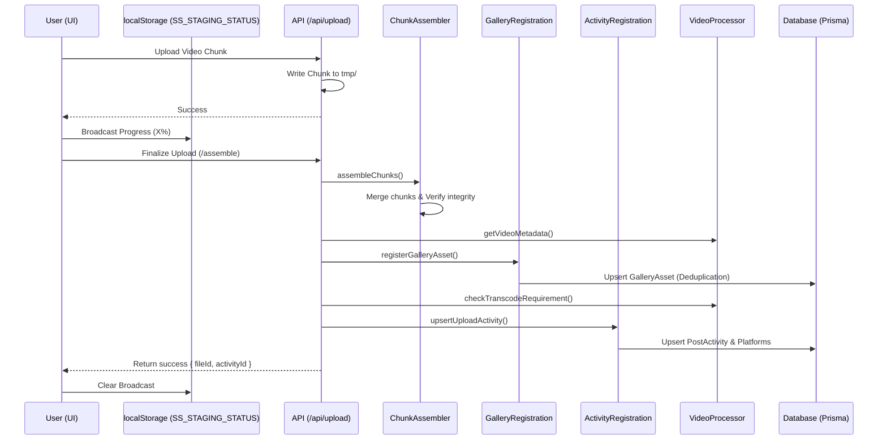
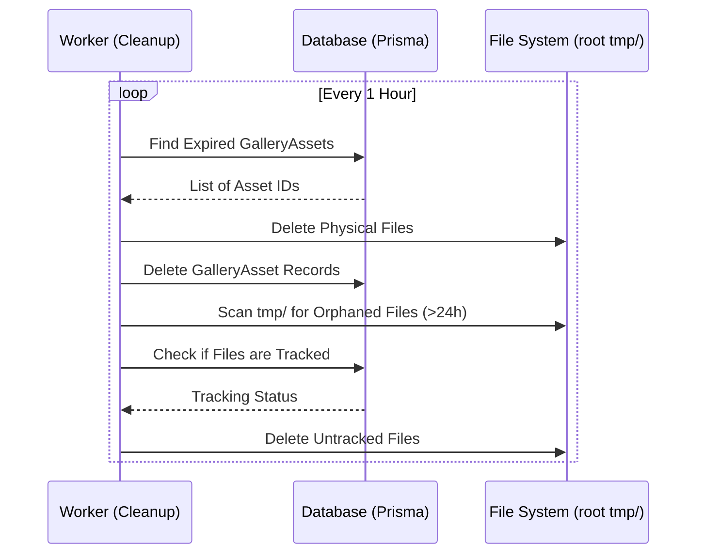

# Media Workflows

## 1. Media Upload & Ingestion

Users upload media which is temporarily stored on the server for processing and distribution. The system uses a **decentralized observation pattern** where upload utilities broadcast progress to `localStorage`, allowing a persistent `UploadHUD` component to provide real-time feedback across the entire application without complex prop-drilling.

The finalization process is orchestrated by specialized modular services to ensure data integrity, gallery consistency, and publishing readiness.

## 2. Asset Cleanup

To maintain storage efficiency, expired assets and orphaned files are purged regularly.

## 3. Modular Upload Infrastructure

The upload pipeline utilizes a suite of specialized services to manage the complex transition from raw binary data to a scheduled post activity.

### Core Services (`src/lib/upload/`)

- **`ChunkAssembler` (`chunk-assembler.ts`)**: Handles the physical concatenation of multi-part uploads. It ensures file integrity via size verification and manages the cleanup of temporary chunk directories.
- **`GalleryRegistration` (`gallery-registration.ts`)**: Manages the persistence of assembled files into the `GalleryAsset` table. It implements deduplication logic to prevent redundant storage of identical assets from the same user.
- **`ActivityRegistration` (`activity-registration.ts`)**: Orchestrates the initialization or update of `PostActivity` records. It handles platform-specific metadata pre-flighting and links the uploaded media to its target distribution channels.
- **`VideoProcessor` (`src/lib/video/processor.ts`)**: Provides metadata extraction (duration, resolution) and determines if the media requires transcoding for specific platform requirements (e.g., aspect ratio checks).

### Integration Logic

These services are composed within the `/api/upload/assemble` route handler, which acts as a transactional orchestrator. This modularity ensures that the upload logic is decoupled from the HTTP transport layer and can be reused in other contexts, such as background processing or administrative tools.
