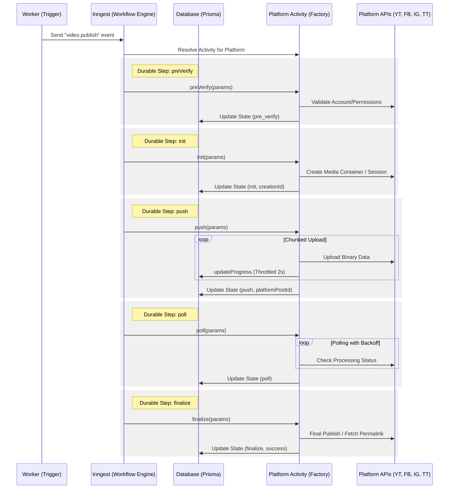

# Publishing Workflows

## 1. Durable Workflow Orchestration (Inngest)

The application uses **Inngest** for durable, event-driven publishing workflows. This replaces simple timeout-based jobs with a resilient orchestration layer that handles platform outages, network glitches, and long-running asynchronous processes (e.g., video processing).

## 2. Platform Activity Pattern

The system follows a **Factory and Strategy Pattern** to decouple the durable workflow logic from platform-specific implementation details.

### Standard Interface (`PlatformActivity`)

All publishing providers must implement the `PlatformActivity` interface:

- **`preVerify`**: Validates account connectivity and platform-specific requirements.
- **`init`**: Initializes the publishing session (e.g., creating a Meta container).
- **`push`**: Handles the binary upload (supports resumable uploads).
- **`poll`**: Waits for the platform to finish processing the media.
- **`finalize`**: Completes the publication and retrieves the final permalink.

### Factory Resolution

The `ActivityRegistry` (`src/lib/platforms/factory.ts`) resolves the correct implementation at runtime based on the target platform.

## 3. Infrastructure Abstraction

To ensure testability and modularity, the publishing system abstracts infrastructure behind interfaces:

- **`StorageProvider`**: Resolves file paths and retrieves file metadata.
- **`PublishingRepository`**: Manages the persistence of publishing state and progress.

These are resolved via a **Service Locator** (`src/lib/infrastructure/index.ts`), allowing for easy mocking in test environments.

## 4. Metadata Pipeline
...

## 4. Automated Token Refresh

To maintain long-term connectivity without requiring frequent user re-authentication, the system implements an automated token refresh mechanism.

- **Trigger:** The background publishing worker checks the expiration status of OAuth tokens for all accounts involved in a scheduled post.
- **Buffer:** Tokens are refreshed if they are set to expire within **15 minutes**.
- **Provider Logic:** 
    - **Google/YouTube:** Uses the `refresh_token` to obtain a new `access_token` via the Google OAuth2 client.
    - **TikTok:** Uses the `refresh_token` to obtain new tokens via the TikTok Content Posting API.
    - **Facebook/Instagram:** Currently relies on long-lived tokens (typically 60 days) and manual re-auth, as Meta handles refresh differently.
- **Persistence:** New tokens and updated expiration timestamps are persisted to the `Account` table immediately after a successful refresh.
- **Audit:** Token refresh events are logged to the system logger for traceability.
