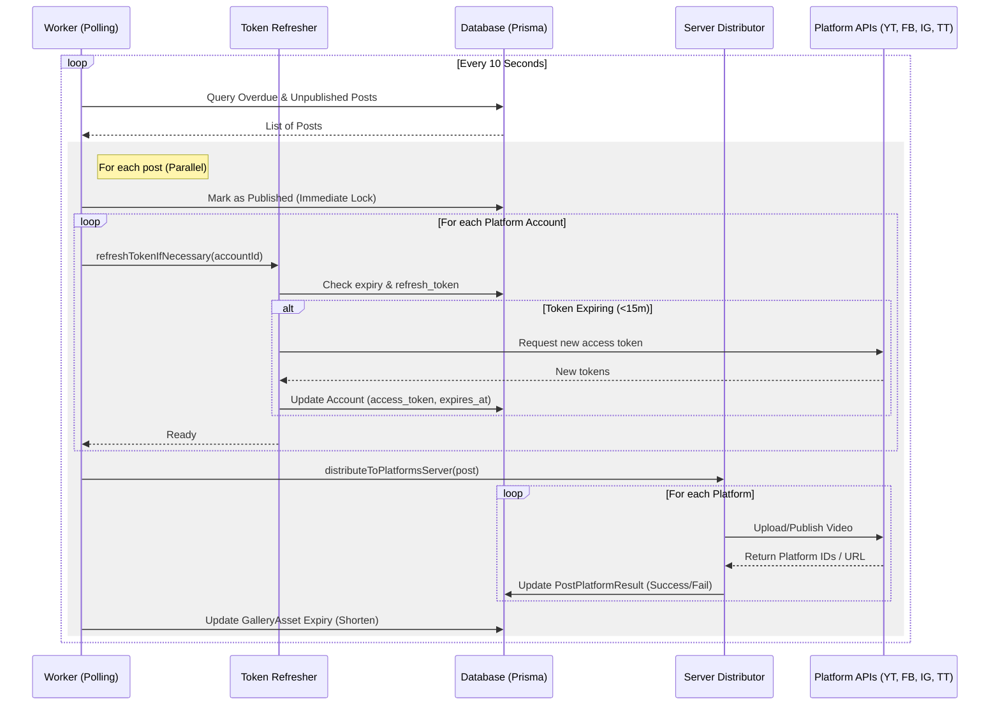

# Publishing Workflows

## 1. Post Distribution (Publishing)

A background worker polls for scheduled posts and distributes them to selected platforms. It automatically refreshes OAuth tokens if they are nearing expiration (within 15 minutes) to ensure uninterrupted publishing.

## 2. Metadata Pipeline

The system supports granular control over platform-specific content (titles, descriptions, hashtags). This flow is documented in detail in:
- **[Metadata Pipeline Architecture](METADATA_PIPELINE.md)**

## 3. Modular Distribution Layer

The platform distribution logic is organized into a modular architecture that separates shared infrastructure from platform-specific implementation details.

### Core Infrastructure (`src/lib/core/platforms/`)

Contains shared utilities and types used across multiple platforms:
- **`account-utils.ts`**: Centralized logic for retrieving platform accounts and logging token usage audits.
- **`meta-uploader.ts`**: Shared binary upload logic for Meta-based platforms (Facebook, Instagram).
- **`meta-utils.ts`**: Common Meta Graph API helpers (polling status, fetching pages).
- **`types.ts`**: Unified interfaces for publishing parameters and results.

### Platform Modules (`src/lib/platforms/`)

Each platform follows a modular subdirectory pattern (e.g., `src/lib/platforms/instagram/`):
- **`account.ts`**: Platform-specific account resolution and permission validation.
- **`container.ts` / `reel.ts`**: Logic for initializing upload sessions or containers.
- **`finalize.ts`**: Steps required to complete a publication (e.g., publishing a container, fetching permalinks).
- **`stats.ts`**: Logic for fetching platform-specific engagement metrics.
- **`[platform].ts`**: The main orchestrator file (e.g., `instagram.ts`) that exports the public API by composing the modular sub-units.

### Server Orchestration

The `server-distributor.ts` acts as the high-level worker orchestrator. To comply with modularity standards, it is decomposed into functional modules:
- **`server-distributor.ts`**: Orchestrates the multi-platform loop.
- **`server-distributor.db.ts`**: Handles all Prisma database interactions.
- **`server-distributor.logic.ts`**: Resolves metadata and file paths.

This decomposition ensures that the core distribution logic remains lean and testable.

## 4. Automated Token Refresh

To maintain long-term connectivity without requiring frequent user re-authentication, the system implements an automated token refresh mechanism.

- **Trigger:** The background publishing worker checks the expiration status of OAuth tokens for all accounts involved in a scheduled post.
- **Buffer:** Tokens are refreshed if they are set to expire within **15 minutes**.
- **Provider Logic:** 
    - **Google/YouTube:** Uses the `refresh_token` to obtain a new `access_token` via the Google OAuth2 client.
    - **TikTok:** Uses the `refresh_token` to obtain new tokens via the TikTok Content Posting API.
    - **Facebook/Instagram:** Currently relies on long-lived tokens (typically 60 days) and manual re-auth, as Meta handles refresh differently.
- **Persistence:** New tokens and updated expiration timestamps are persisted to the `Account` table immediately after a successful refresh.
- **Audit:** Token refresh events are logged to the system logger for traceability.
