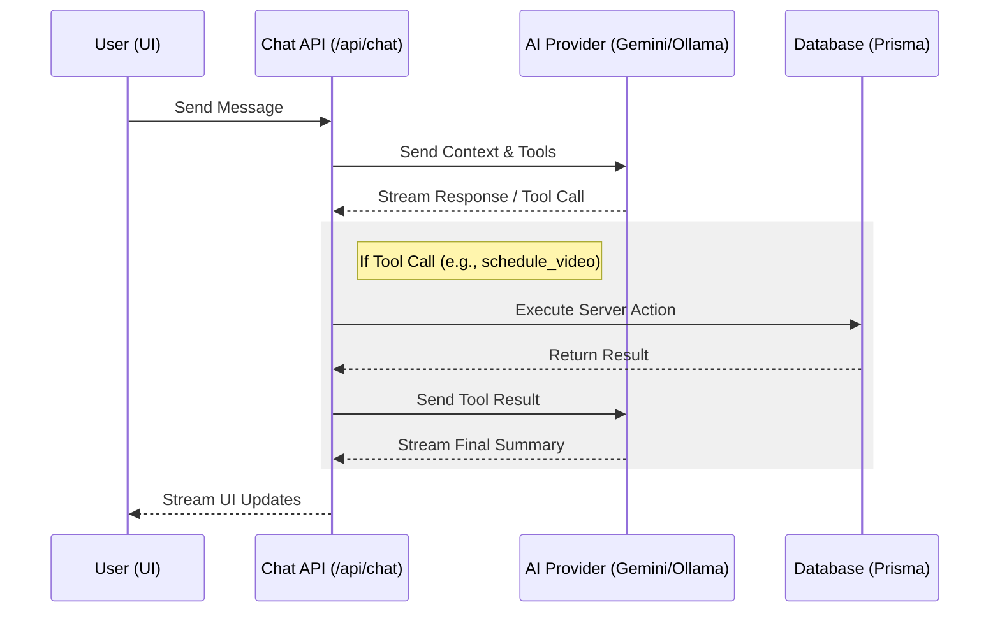
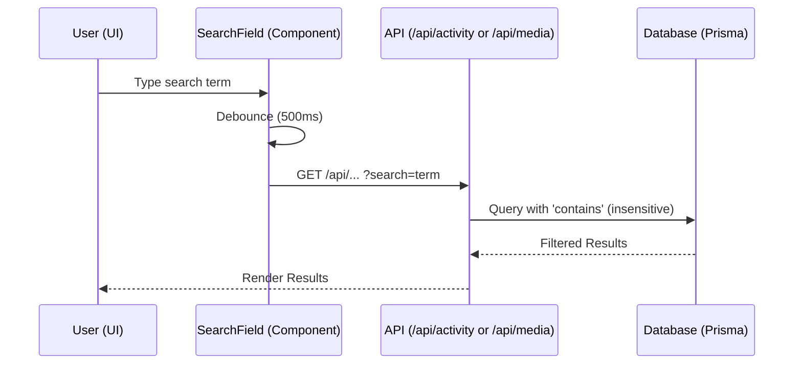

# UI & Feature Components

## 1. AI Chatbot Assistant

The AI Chatbot provides a conversational interface for users to manage their content, schedule posts, and view staged media. It leverages the Vercel AI SDK to stream responses and execute server-side tools.

## 2. Global Search

A unified search mechanism provides server-side filtering for activity and media assets.

## 3. Platform BYOK (Bring Your Own Key)

The BYOK Integration Wizard allows power users to provide their own platform API credentials (Client ID, Secret, Redirect URI), bypassing global application-level rate limits.

- **Implementation:** Leverages hardened **Next.js 15 Server Actions** (`validateAndSaveByokAction`) for credential validation and persistence.
- **Storage:** Credentials are persisted in the database using the `ByokCredential` model. The `clientSecret` is encrypted at rest using AES-256-GCM.
- **Credential Resolution:** A centralized `CredentialProvider` utility (`src/lib/core/credential-provider.ts`) manages the resolution of credentials, prioritizing user-provided BYOK keys.

## 4. Bring Your Own Storage (BYOS)

Users can connect their own S3/R2 storage to bypass server limits.

- **Orchestration:** Managed via hardened **Server Actions** (`saveByosConfigAction`) that perform multi-stage validation checks (Encryption, Bucket Access, Permissions).
- **Direct Upload:** Browser uploads directly to the user's bucket using presigned URLs.
- **Streaming Distribution:** Media is streamed directly from the user's bucket to platform APIs during publishing.

## 5. Global Refresh Mechanism

Social Studio implements a unified refresh system to ensure data consistency between server-side state and client-side components.

- **Centralized Logic:** The `useAppRefresh` hook handles the orchestration of `router.refresh()` (for server components) and the dispatching of custom events (for client components).
- **Event Synchronization:** Components can synchronize their state by listening to the `app:refresh` event on `globalThis`.
- **Mobile Gestures:** The system is integrated with a "Pull-to-Refresh" mechanism in the `LayoutWrapper`.

## 6. Activity Domain Architecture

The Activity domain manages the record of all past and upcoming posts.

- **Decomposed Server Actions:** Logic for fetching, retrying, and canceling activity items is split into specialized modules within `src/app/actions/activity/`.
- **Specialized Hooks:** A composite `useActivity` hook orchestrates multiple sub-hooks to manage complex state and logic (filters, pagination, data storage, adaptive polling).
- **Optimistic UI & Reconciliation**: The `useActivity` hook centralizes the logic for merging active "pending" posts with historical data.

## 7. Complex UI Form Architecture (Modular Engine)

Complex forms (like the Upload Form) follow a "Modular Engine" pattern to manage deep state and UI complexity while adhering to the 50-line rule.

- **Provider-Consumer Pattern:** The form is wrapped in a dedicated `UploadFormProvider` (Context) that consolidates state from props, custom hooks, and local signals.
- **Atomic Decomposition:** Large forms are broken down into a hierarchy of atomic, single-responsibility components.

## 8. Standard View Pattern (Server Shell / Client Content)

To optimize for SEO (Metadata API) and maintain strict modularity (50-line rule), all primary views follow a standard decomposition pattern:

- **Server Shell (`page.tsx`):** A server component that exports static or dynamic `metadata`, handles initial server-side auth/data fetching, and renders a `Suspense` boundary around the client content.
- **Client Content (`*Content.tsx`):** A focused client component (marked with `'use client'`) that manages interactive state, hooks, and complex UI logic.
- **Benefits:** This separation ensures that logic-heavy client components don't block the export of static metadata and makes it easier to stay within the 50-line modularity limit.
