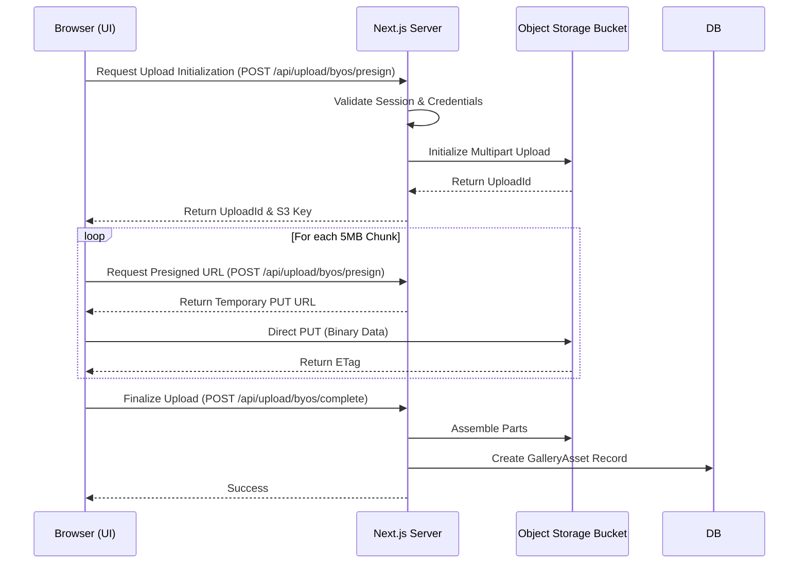

# Bring Your Own Storage (BYOS)

Bring Your Own Storage (BYOS) allows power users and enterprises to connect their own S3-compatible object storage to Social Studio. This bypasses server-side storage limits, eliminates double-bandwidth egress costs, and ensures users maintain full ownership of their original media assets.

## Key Benefits

- **Unlimited Storage:** Bound only by your storage provider's limits.
- **Cost Efficiency:** Directly upload to zero-egress providers like Cloudflare R2.
- **Data Sovereignty:** All media stays in your own infrastructure.
- **High Performance:** Direct browser-to-bucket multi-part uploads.

## Supported Providers

Social Studio supports any standardized S3-compatible Object Storage, with optimized templates for:
- **Cloudflare R2** (Recommended - Zero Egress)
- **AWS S3**
- **Google Cloud Storage** (via S3 XML API)
- **Backblaze B2**
- **DigitalOcean Spaces**

## Technical Architecture

### 1. Credentials Security
Credentials (Access Key, Secret Key) are encrypted at rest using **AES-256-GCM**.
- **Encryption Key:** Managed via the server-side `BYOS_ENCRYPTION_KEY` environment variable.
- **Masking:** Secret keys are masked in the UI and never returned in full after initial configuration.

### 2. Direct Upload Pipeline
To protect server resources, Social Studio uses a **Direct-to-Bucket** upload flow:



### 3. Distribution Stream
When publishing a video to platforms (YouTube, TikTok, etc.), Social Studio streams the file directly from your bucket to the destination platform API, ensuring a minimal memory footprint (< 50MB).

## Configuration Requirements

To use BYOS, your bucket must have **CORS (Cross-Origin Resource Sharing)** enabled to allow the Social Studio web client to perform direct PUT requests.

### Recommended CORS Policy
```json
[
  {
    "AllowedHeaders": ["*"],
    "AllowedMethods": ["PUT", "POST", "GET", "HEAD"],
    "AllowedOrigins": ["*"],
    "ExposeHeaders": ["ETag"],
    "MaxAgeSeconds": 3000
  }
]
```
