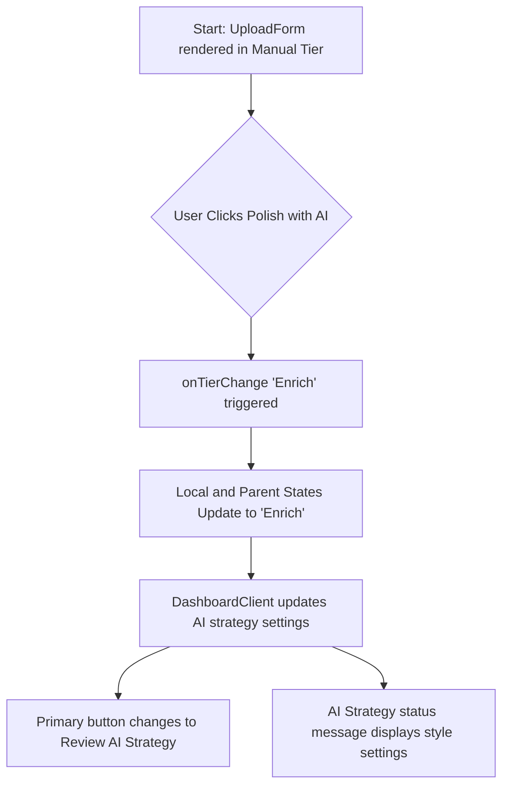

# Manual Mode AI Enhancement (Polish with AI)

Social Studio provides multiple AI tiers for drafting post metadata: Manual, Enrich, and Generate. The **Manual Mode AI Enhancement** feature introduces an in-context upgrade path from the Manual drafting workflow directly to the Enrich AI workflow.

## Overview

In the default Manual drafting flow, the user has full control to write the video title and description. To encourage user adoption of AI-driven optimization without disrupting their workflow, a secondary **Polish with AI** button is introduced in the action bar, placed side-by-side with the primary **Post Video** button.

This integration provides a seamless UX bridge:
1. **Context Preservation:** Clicking "Polish with AI" updates the active AI tier to **Enrich**.
2. **Dynamic UI Transformation:** The primary action button instantly changes from "Post Video" to "Review AI Strategy".
3. **State Syncing:** Existing titles/descriptions written by the user are preserved and passed to the AI as the source draft for polishing.

---

## State & Action Flow



---

## Component API & Layout Integration

The button is integrated inside `src/components/dashboard/UploadForm/index.tsx` within the bottom action button container.

### Layout Implementation

The action bar uses a responsive flex row with a dynamic flex-grow configuration:
- **Polish with AI Button:** Takes `flex: 1` to balance the layout. Uses `React.startTransition` to update the AI tier, ensuring the button hides immediately and the UI transforms without lag from background server actions.
- **Primary Submit Button:** Takes `flex: 1.2` when another action button is visible, creating a clear visual hierarchy.

```tsx
<div style={{ display: 'flex', gap: '1rem', marginTop: '0.5rem' }}>
  {mounted && aiTier === 'Manual' && !isUploading && (
    <button
      type="button"
      onClick={() => onTierChange('Enrich')}
      style={{
        flex: 1,
        display: 'flex',
        alignItems: 'center',
        justifyContent: 'center',
        gap: '0.5rem',
        padding: '1rem',
        borderRadius: '0.75rem',
        background: 'linear-gradient(135deg, hsla(var(--primary) / 0.1), hsla(var(--primary) / 0.05))',
        border: '1px solid hsla(var(--primary) / 0.3)',
        color: 'hsl(var(--primary))',
        fontWeight: 700,
        cursor: 'pointer',
        transition: 'all 0.2s ease',
        fontSize: '0.9rem'
      }}
    >
      <AutoAwesomeIcon sx={{ fontSize: 18 }} /> Polish with AI
    </button>
  )}

  <button 
    type="submit" 
    disabled={isUploading}
    style={{ 
      flex: (hasCachedPreviews || (mounted && aiTier === 'Manual' && !isUploading)) ? 1.2 : 1,
      background: 'hsl(var(--primary))', 
      color: 'white', 
      border: 'none', 
      padding: '1rem', 
      borderRadius: '0.75rem', 
      fontWeight: 700, 
      cursor: isUploading ? 'not-allowed' : 'pointer', 
      boxShadow: '0 4px 12px hsla(var(--primary) / 0.2)', 
      fontSize: '1rem',
      display: 'flex',
      alignItems: 'center',
      justifyContent: 'center',
      gap: '0.5rem'
    }}
  >
    {isUploading ? <UploadIcon className="animate-pulse" /> : (aiTier !== 'Manual' ? (hasCachedPreviews ? <RefreshIcon /> : <AutoAwesomeIcon />) : <RocketLaunchIcon />)}
    {isUploading ? 'Launching...' : (aiTier !== 'Manual' ? (hasCachedPreviews ? 'Regenerate Strategy' : 'Review AI Strategy') : 'Post Video')}
  </button>
</div>
```

---

## Technical Considerations & Hydration Guard

To ensure a seamless user experience and strict adherence to React server-side rendering (SSR) standards:
- **Hydration Deferral:** The `DashboardClient` reads the initial `aiTier` state from `localStorage` within a `useEffect` hook post-mount.
- **Stable Layout Skeletons:** The button relies on a `mounted` check to prevent hydration mismatch errors, ensuring the server-rendered markup exactly matches the client's initial render structure.
- **Type Safety:** The transition is strictly verified using TypeScript and matches the `AITier` schema (`'Manual' | 'Enrich' | 'Generate'`).
