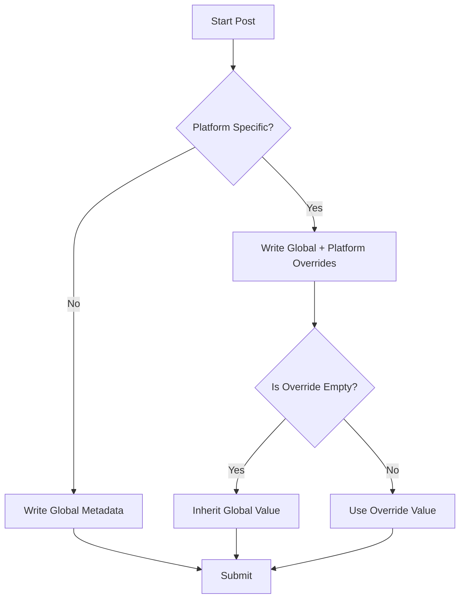

# Advanced Metadata & Templates

The Advanced Metadata suite allows users to manage platform-specific nuances while maintaining efficiency through inheritance and reusable snippets. This feature is crucial for creators distributing to multiple channels with distinct audiences and constraints.

## Overview

Users can choose between a unified "Global" strategy or dive into "Platform-Specific" overrides. The system intelligently handles character limits, content inheritance, and reusable snippets (e.g., standard descriptions, "Link in Bio" text) to streamline the workflow.

## Core Components

### 1. Platform-Specific Overrides & Inheritance
- **Per-Platform Fields:** When enabled, users can define distinct titles and descriptions for each selected channel (e.g., YouTube Shorts vs. TikTok).
- **Intelligent Inheritance:** If a platform-specific field is left blank, the system automatically inherits the content from the "Global" metadata fields during submission. This ensures content is always present while minimizing redundant typing.

### 2. Character Limit Validation
- **Real-time Feedback:** Inputs display character counters (e.g., `55/100`) that turn orange (warning) or red (exceeded) as users type.
- **Platform Constraints:** Hardcoded limits based on API restrictions:
  - YouTube: 100 char Title, 5000 char Description
  - TikTok: 4000 char Description
  - Instagram: 2200 char Description
  - Facebook: 5000 char Description
- **AI Review Integration:** The AI Review step also respects and displays these limits when users manually tweak AI-generated content.

### 3. Snippet Management
- **Upload Dashboard:** Users can select existing snippets or save the current description as a new snippet directly from the upload form (global or per-platform).
- **Settings Page:** A dedicated `/settings` section provides full CRUD (Create, Read, Update, Delete) capabilities for organizing saved snippets.

## Technical Implementation

### Data Model
Managed via Prisma in `prisma/schema.prisma`:
- **Model:** `MetadataTemplate`
- **Fields:** `id`, `userId` (owner), `name`, `content` (text), `createdAt`, `updatedAt`.

### State Management & UX
Enhanced `useUploadForm` hook in `src/hooks/dashboard/useUploadForm.ts`:
- Manages state for `isPlatformSpecific`, `platformTitles`, and `platformDescriptions`.
- Local storage syncing ensures drafts are not lost during navigation.

**Inheritance Logic:** Implemented directly in `DashboardClient.tsx` before API submission:
```typescript
const customContent = isPlatformSpecific ? { 
  title: platformTitle || globalTitle, 
  description: platformDescription || globalDescription 
} : undefined;
```

## Quality Assurance

### Automated Testing
- **Unit Tests:** `src/__tests__/unit/metadata-actions.test.ts` covers snippet CRUD operations.
- **E2E Tests:** Playwright specs (`snippets.spec.ts`, `settings.spec.ts`) verify UI workflows.

### Manual Verification
Refer to the following UAT scripts:
- [UAT Script: Metadata Templates](../manual_tests/verify-metadata-templates.md) (Core Flow + Inheritance/Limits)

## User Flow


